  

<h3 align="center">Hi, I'm Shreya 👋</h3>

  I'm a B.Tech student in <b>Artificial Intelligence &amp; Machine Learning</b> who likes building the <i>whole</i> thing: 
  the fast C++ engine underneath, the AI that makes it smart, and the web app people actually click on.

  Lately that means <b>RAG apps</b> that answer only from your own documents, <b>AI automations</b> that run while I sleep, 
  and a <b>pathfinding engine</b> that finds the shortest route through real city streets.

---

### 🧭 What I build

- **Engines in C++** — an A\* pathfinding engine that runs on real OpenStreetMap road data, with a live map to watch it think.
- **AI apps** — a full-stack RAG knowledge base: upload PDFs, ask questions, get answers with the exact sources.
- **AI automations** — n8n workflows that connect Gmail, Google Gemini, Slack and Google Sheets.
- **ML experiments** — comparing classic ML models on medical data to see which one you'd actually trust.

---

### 🛠️ My toolbox

   
  

  
  
  
  
  
  

<b>👀 Where I've actually used these</b> (click to fold)

 

| Area | Tools | Used in |
|---|---|---|
| **Languages** | C++17, Python, JavaScript | every project below |
| **AI / LLMs** | RAG, pgvector (vector search), Ollama (local LLMs), Google Gemini | [RAG Knowledge Base](https://github.com/ShreyaChourasia/Rag-based_knowledge), [Daily Email Digest](https://github.com/ShreyaChourasia/Daily-email-digest-n8n) |
| **Machine Learning** | scikit-learn, pandas, NumPy, SMOTE, Jupyter | [Breast Cancer ML](https://github.com/ShreyaChourasia/Application-of-ML-models-on-Breast-Cancer-Datasets) |
| **Backend** | Node.js, Express, JWT auth, streaming (SSE), Zod | [RAG Knowledge Base](https://github.com/ShreyaChourasia/Rag-based_knowledge) |
| **Frontend** | React, Next.js, Vite, deck.gl + MapLibre maps | [Atlas Pathfinder](https://github.com/ShreyaChourasia/Atlas-pathfinder), [RAG Knowledge Base](https://github.com/ShreyaChourasia/Rag-based_knowledge) |
| **Data** | PostgreSQL, OpenStreetMap (osmnx) | [RAG Knowledge Base](https://github.com/ShreyaChourasia/Rag-based_knowledge), [Atlas Pathfinder](https://github.com/ShreyaChourasia/Atlas-pathfinder) |
| **Automation** | n8n, Gmail API, Slack, Google Sheets, OAuth2 | [Daily Email Digest](https://github.com/ShreyaChourasia/Daily-email-digest-n8n), [n8n Journey](https://github.com/ShreyaChourasia/n8n-Journey-Projects) |
| **Shipping** | Docker, Nginx, CMake, Vitest, Git | [RAG Knowledge Base](https://github.com/ShreyaChourasia/Rag-based_knowledge), [Atlas Pathfinder](https://github.com/ShreyaChourasia/Atlas-pathfinder) |

---

### 🚀 Featured projects

<table>
<tr>
<td width="50%" valign="top">

#### 🗺️ [Atlas Pathfinder](https://github.com/ShreyaChourasia/Atlas-pathfinder)
A\* shortest-path engine in **C++17** that runs on real city streets (Rome, Mumbai), with a **Next.js + deck.gl** map where you click two points and watch the search happen.

**Highlight:** on real Rome streets it finds the best 2.48 km route while checking only ~32% of the map.

How it works

`OpenStreetMap` → Python extractor → **C++ A\* engine** → JSON → web map

</td>
<td width="50%" valign="top">

#### 📚 [RAG Knowledge Base](https://github.com/ShreyaChourasia/Rag-based_knowledge)
Upload PDFs, ask questions, and get answers **only from your documents**, with sources cited. Runs fully on your laptop with a local LLM.

**Highlight:** built in 10 phases, from search to streaming answers, login, tests and Docker deploy.

How it works

React → **Node.js + Express** → PostgreSQL + pgvector → Ollama (llama3.1)

</td>
</tr>
<tr>
<td width="50%" valign="top">

#### 📬 [Daily Email Digest](https://github.com/ShreyaChourasia/Daily-email-digest-n8n)
Every morning at 8 AM it reads unread Gmail, asks **Google Gemini** for a 1–2 line summary of each mail, and posts one tidy digest to Slack.

**Highlight:** handles the boring edge cases too: no new mail, and Gmail errors.

How it works

Schedule → Gmail → **Gemini summary** → Slack

</td>
<td width="50%" valign="top">

#### 🩺 [Breast Cancer ML](https://github.com/ShreyaChourasia/Application-of-ML-models-on-Breast-Cancer-Datasets)
Compares KNN, Decision Tree, Random Forest and SVM on the Wisconsin breast cancer dataset (569 patients) to predict benign vs malignant.

**Highlight:** SVM came out on top at ~97% accuracy.

How it works

Clean data → explore → balance with SMOTE → train 4+ models → compare

</td>
</tr>
</table>

---

### 🔨 Currently building

<table>
<tr>
<td width="50%" valign="top">

#### 🏥 GramSathi (in progress)
A health **screening and triage** assistant for rural and underprivileged communities. People describe their symptoms in a simple form, and an **agentic AI** system (a local LLM with Ollama, plus BERT) decides how urgent the case is.

**Goal:** keep a queue sorted by severity and check bed availability, so the most urgent patients are seen first.

</td>
<td width="50%" valign="top">

#### 🌾 SetuBiz (Smart India Hackathon 2026)
An **AI business advisor** for rural micro-entrepreneurs. It gives advice suited to their local area and helps them plan their money and financing.

**Problem statement:** SIH26091, from the Ministry of Social Justice and Empowerment.

</td>
</tr>
<tr>
<td colspan="2" valign="top">

#### 🛒 Amazon ML Challenge 2026 (in progress)
**Business Entity Resolution:** figuring out when records from 3 different sources are actually the same business, even when names and details don't match exactly.

**Progress:** ~0.98 score so far, pushing for 0.99, without cutting corners on correctness.

</td>
</tr>
</table>

---

### 🌱 Right now

- Going deeper into **RAG and AI agents**, and making them reliable, not just demo-able.
- Building more **n8n automations** that save real hours.
- 📫 Open to **internships** in AI/ML and full-stack roles.

### 🤝 Let's connect

  
  

